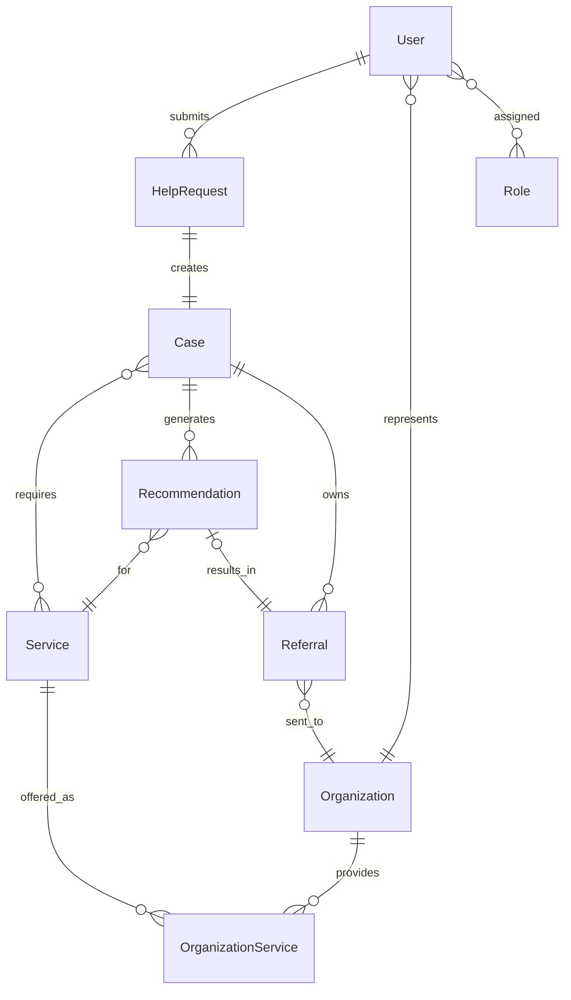
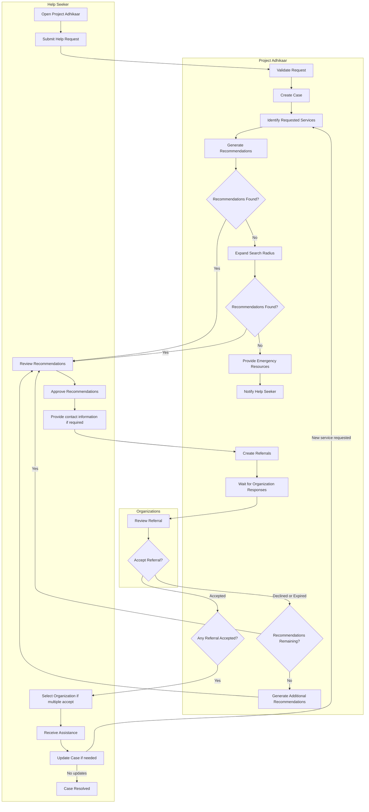
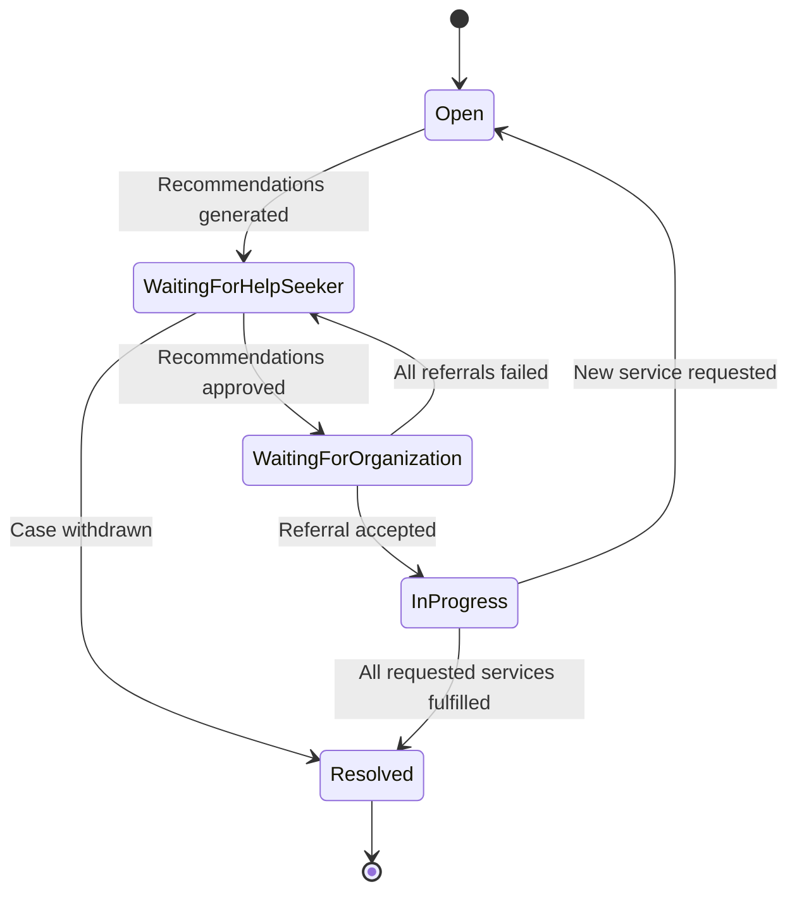
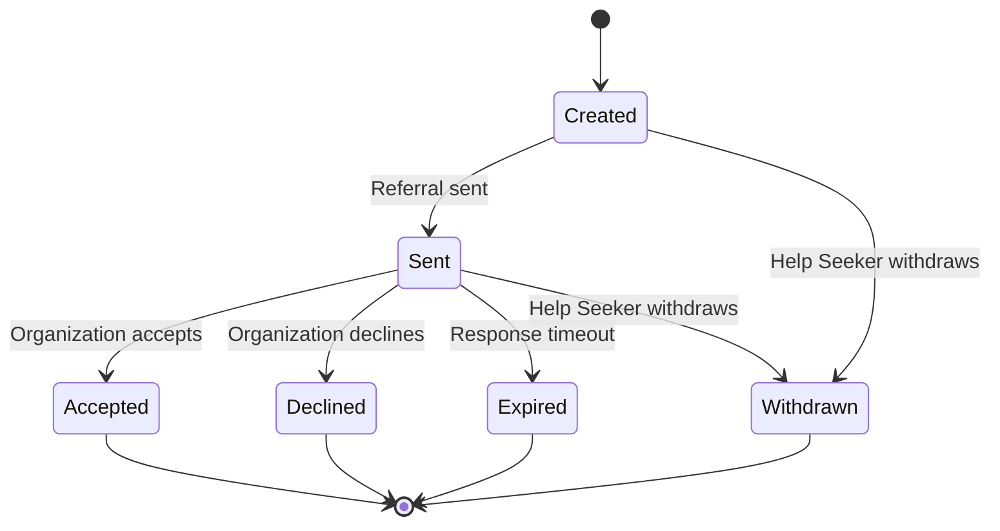

# Domain — Project Adhikaar

> **Purpose:** This document defines the business domain of Project Adhikaar. It serves as the single source of truth for domain terminology, concepts, relationships, business rules, and workflows. It intentionally avoids implementation details such as database schemas, APIs, and technology choices.

**Table of Contents**

1. [Glossary](#glossary)
2. [Domain Relationships](#domain-relationships)
3. [Workflows & Lifecycles](#workflows--lifecycles)
4. [Business Rules](#business-rules)

# Glossary

The following terms have precise meanings within Project Adhikaar.

| Term                        | Definition                                                                                                                   |
| --------------------------- | ---------------------------------------------------------------------------------------------------------------------------- |
| User                      | Any human participant interacting with Project Adhikaar.                                                                     |
| Help Seeker                 | A User seeking assistance through Project Adhikaar.                                                                        |
| Organization                | An entity capable of providing one or more support services.                                                                 |
| Organization Representative | A User authorized to act on behalf of an Organization.                                                                     |
| Help Request                | The initial request submitted by a Help Seeker describing their situation and support needs.                                 |
| Case                        | The ongoing coordination of assistance after a Help Request has been submitted.                                              |
| Recommendation              | A suggested Organization identified as suitable for a Case.                                                                  |
| Referral                    | A request sent to an Organization after the Help Seeker approves a Recommendation.                                           |
| Service                     | A category of assistance provided by Organizations.                                                                          |
| Resource                    | Trusted information that helps people understand their rights or access support.                                             |
| Anonymous                   | A Help Seeker who chooses not to disclose personally identifying information beyond what is necessary to receive assistance. |
| Verified Organization       | An Organization that satisfies Project Adhikaar's verification requirements.                                                 |

# Core Domain Concepts

## Help Request

HelpRequest represents the initial request for assistance submitted by a help seeker. It captures the original description, safety status, location, optional contact information, and optional preferred language. A HelpRequest may be anonymous (userId is nullable) and may later become exactly one Case.

## Case

Case is the platform's working representation of a HelpRequest. It owns the confirmed required services, tracks the overall case lifecycle, and is the parent of Recommendations and Referrals.

Unlike a Help Request, a Case is a living record that evolves as assistance progresses. It is the primary entity used for recommendations, referrals, and tracking the progress of assistance.

## Recommendation

Recommendation represents a persistent recommendation generated by the platform for a specific OrganizationService. Recommendations await user approval before a Referral can be created and remain stored for auditing and future re-ranking.

## Referral

Referral represents a recommendation approved by the help seeker and sent to an organization. It maintains an immutable snapshot of the information explicitly shared with the organization and tracks the referral lifecycle independently of the HelpRequest.

## OrganizationService

Each OrganizationService defines eligibility requirements, geographical coverage, supported languages, and whether the service is currently available.

## Service

Services are platform-managed reference data and cannot currently be created by organizations.

## Language

# Domain Relationships

# Domain Relationships

| Relationship                          | Cardinality                        | Reason                                                                                                                                           | Status |
| ------------------------------------- | ---------------------------------- | ------------------------------------------------------------------------------------------------------------------------------------------------ | ------ |
| User ↔ Role                           | M:N                                | A User may assume multiple Roles throughout their lifetime, and each Role may be assigned to many Users.                                        | 🟢 |
| User ↔ HelpRequest                    | 1:N                                | A User may create multiple Help Requests over time, while a Help Request may optionally belong to one authenticated User.                       | 🟢 |
| HelpRequest ↔ Case                    | 1:1                                | A Help Request may become exactly one Case, and every Case originates from one Help Request.                                                    | 🟢 |
| Case ↔ Service                        | M:N                                | A Case owns the confirmed services required by the help seeker. A Service may be required by many Cases.                                        | 🟢 |
| Case ↔ Recommendation                 | 1:N                                | A Case may have multiple Recommendations generated over its lifetime.                                                                            | 🟢 |
| Recommendation ↔ OrganizationService  | N:1                                | Each Recommendation refers to one OrganizationService, while an OrganizationService may appear in many Recommendations.                         | 🟢 |
| Recommendation ↔ Referral             | 1:1                                | A Recommendation may result in at most one Referral, and every Referral originates from one approved Recommendation.                            | 🟢 |
| Case ↔ Referral                       | 1:N                                | A Case may have multiple Referrals as different recommendations are approved over time.                                                         | 🟢 |
| Organization ↔ OrganizationService    | 1:N                                | An Organization may provide many OrganizationServices, each describing one service offered by that Organization.                               | 🟢 |
| OrganizationService ↔ Service         | N:1                                | Each OrganizationService represents one Service offered by an Organization. A Service may be offered by many Organizations.                     | 🟢 |
| OrganizationService ↔ Language        | M:N                                | An OrganizationService may be delivered in multiple Languages, and each Language may be supported by many OrganizationServices.                 | 🟢 |
| HelpRequest ↔ Language                | N:1                                | A Help Request may optionally specify one preferred Language for communication.                                                                 | 🟢 |
| Service ↔ Resource                    | M:N                                | A Service may be explained by multiple Resources, and a Resource may explain multiple Services.                                                 | 🟡 |
| Case ↔ Resource                       | M:N                                | A Case may reference multiple Resources, and a Resource may be relevant to many Cases.                                                          | 🟡 |

## Domain Relationship Diagram

> _**Note:** This diagram represents conceptual domain relationships rather than database tables. Some many-to-many relationships may be implemented using junction tables in the persistence layer, while others (such as OrganizationService) are themselves first-class domain concepts._

# Workflows & Lifecycles

## Help Journey

## Case Lifecycle

| State                        | Meaning                                                                                                 | Next Action By             |
| ---------------------------- | ------------------------------------------------------------------------------------------------------- | -------------------------- |
| **Open**                     | The Case has been created and the platform is preparing recommendations.                                | Platform                   |
| **Waiting for Help Seeker**  | Recommendations are ready. The platform is waiting for the Help Seeker to approve, modify, or withdraw. | Help Seeker                |
| **Waiting for Organization** | Referrals have been sent. Waiting for organizations to respond.                                         | Organization               |
| **In Progress**              | At least one organization is actively assisting.                                                        | Help Seeker + Organization |
| **Resolved**                 | All required services have been completed or the Case has otherwise concluded.                          | None                       |

## Referral Lifecycle

| State         | Meaning                                                                             | Owner of Next Action       |
| ------------- | ----------------------------------------------------------------------------------- | -------------------------- |
| **Created**   | The Help Seeker approved the recommendation, but the referral hasn't been sent yet. | Platform                   |
| **Sent**      | The Organization has received the referral.                                         | Organization               |
| **Accepted**  | The Organization agrees to provide the requested service.                           | Help Seeker / Organization |
| **Declined**  | The Organization cannot take the referral.                                          | Platform                   |
| **Expired**   | The Organization didn't respond within the allowed time.                            | Platform                   |
| **Withdrawn** | The Help Seeker withdrew the referral before it was accepted.                       | None                       |

# Business Rules

Business rules describe how the domain behaves independently of technology.

## Privacy

- Personally identifying information should only be collected when necessary.
- Anonymous Help Requests are supported whenever operationally feasible.
- The Help Seeker decides what information is shared with Organizations.

## User Agency

- Organizations are never contacted without the Help Seeker's approval.
- Recommendations exist to preserve user choice.
- The Help Seeker may approve one or more Recommendations.

## Recommendations

- Recommendations are generated based on the information available in the Case.
- Recommendations do not guarantee acceptance by an Organization.
- Multiple Recommendations may exist for the same Case.

## Referrals

- A Referral may only be created from an approved Recommendation.
- Each Referral targets exactly one Organization.
- Multiple Referrals may exist for a single Case.
- Referrals may expire if no response is received within the configured timeframe.

## Organizations

- Organizations may accept or decline Referrals.
- Organizations only receive information explicitly approved for sharing.
- Verification status is managed according to Project Adhikaar's verification policy.

## Resources

- Resources should be accurate, trustworthy, and regularly reviewed.
- Resources may support both Services and Cases.
- Resources do not replace professional assistance.
