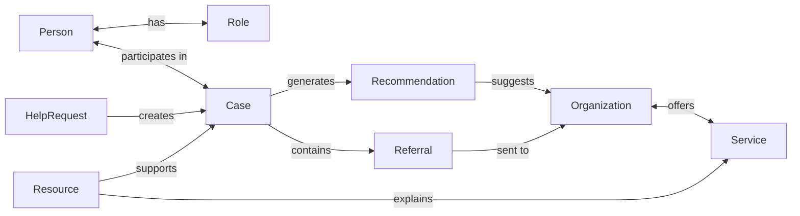
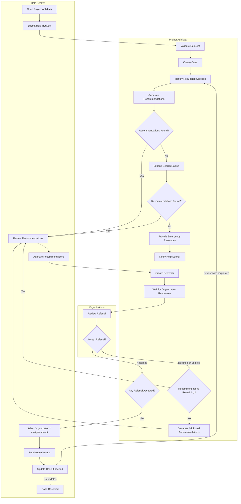
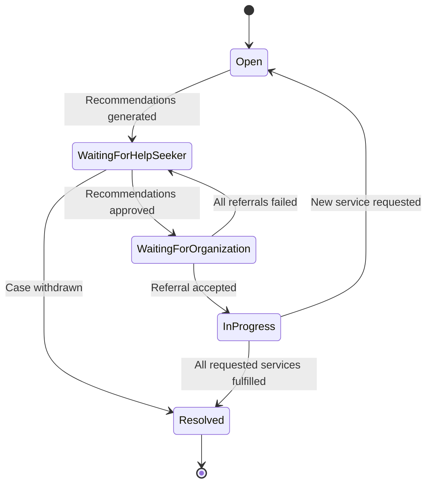
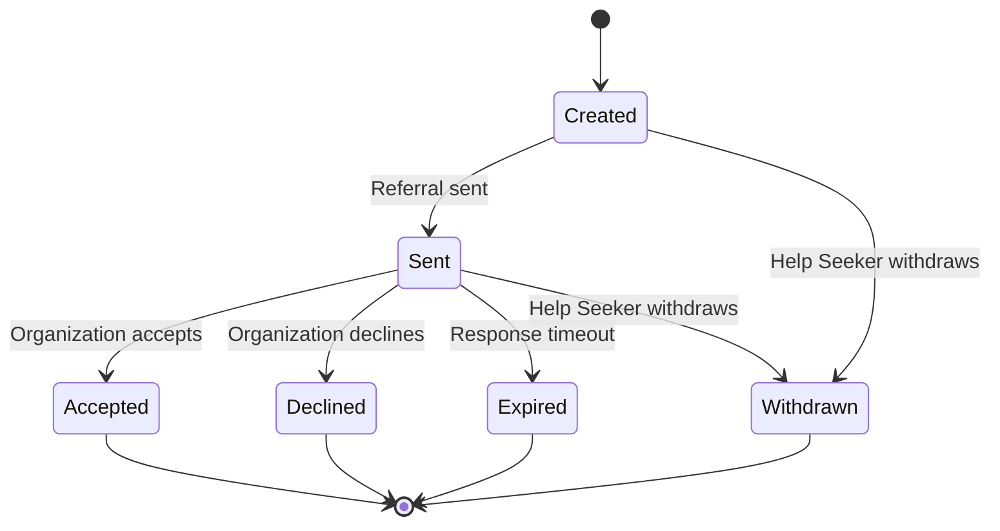

# Domain — Project Adhikaar

> **Purpose:** This document defines the business domain of Project Adhikaar. It serves as the single source of truth for domain terminology, concepts, relationships, business rules, and workflows. It intentionally avoids implementation details such as database schemas, APIs, and technology choices.

**Table of Contents**

1. [Glossary](#glossary)
2. [Domain Relationships](#domain-relationships)
3. [Workflows & Lifecycles](#workflows--lifecycles)
4. [Business Rules](#business-rules)

# Glossary

The following terms have precise meanings within Project Adhikaar.

| Term                        | Definition                                                                                                                   |
| --------------------------- | ---------------------------------------------------------------------------------------------------------------------------- |
| Person                      | Any human participant interacting with Project Adhikaar.                                                                     |
| Help Seeker                 | A Person seeking assistance through Project Adhikaar.                                                                        |
| Organization                | An entity capable of providing one or more support services.                                                                 |
| Organization Representative | A Person authorized to act on behalf of an Organization.                                                                     |
| Help Request                | The initial request submitted by a Help Seeker describing their situation and support needs.                                 |
| Case                        | The ongoing coordination of assistance after a Help Request has been submitted.                                              |
| Recommendation              | A suggested Organization identified as suitable for a Case.                                                                  |
| Referral                    | A request sent to an Organization after the Help Seeker approves a Recommendation.                                           |
| Service                     | A category of assistance provided by Organizations.                                                                          |
| Resource                    | Trusted information that helps people understand their rights or access support.                                             |
| Anonymous                   | A Help Seeker who chooses not to disclose personally identifying information beyond what is necessary to receive assistance. |
| Verified Organization       | An Organization that satisfies Project Adhikaar's verification requirements.                                                 |

# Domain Relationships

| Relationship                  | Cardinality                        | Reason                                                                                                                              | Status |
| ----------------------------- | ---------------------------------- | ----------------------------------------------------------------------------------------------------------------------------------- | ------ |
| Person ↔ Role                 | M:N                                | A Person may assume multiple Roles throughout their lifetime, and each Role may be assumed by many People.                          | 🟢     |
| Person ↔ Case                 | M:N _(likely through Participant)_ | A Person may participate in multiple Cases throughout their lifetime, and each Case may involve multiple People in different Roles. | 🟢     |
| Case ↔ Help Request           | 1:1                                | A Help Request creates a Case.                                                                                                      | 🟡     |
| Case ↔ Recommendation         | 1:N                                | A case may result in multiple recommendations.                                                                                      | 🟢     |
| Recommendation ↔ Organization | N:1                                | One recommendation can reference only one organization. One organization may appear in many recommendations.                        | 🟢     |
| Case ↔ Referral               | 1:N                                | A Case may result in multiple Referrals because assistance can be requested from multiple Organizations.                            | 🟢     |
| Referral ↔ Organization       | N:1                                | Each Referral is addressed to exactly one Organization, while an Organization may receive many Referrals over time.                 | 🟢     |
| Organization ↔ Service        | M:N                                | One organization may provide multiple services and a service can be provided by multiple organizations.                             | 🟢     |
| Service ↔ Resource            | M:N                                | A Service may be explained by multiple Resources, and a Resource may explain multiple Services.                                     | 🟡     |
| Case ↔ Resource               | M:N                                | A Case may reference multiple Resources, and a Resource may be relevant to many Case.                                               | 🟡     |

## Domain Relationship Diagram

# Workflows & Lifecycles

## Help Journey

## Case Lifecycle

| State                        | Meaning                                                                                                 | Next Action By             |
| ---------------------------- | ------------------------------------------------------------------------------------------------------- | -------------------------- |
| **Open**                     | The Case has been created and the platform is preparing recommendations.                                | Platform                   |
| **Waiting for Help Seeker**  | Recommendations are ready. The platform is waiting for the Help Seeker to approve, modify, or withdraw. | Help Seeker                |
| **Waiting for Organization** | Referrals have been sent. Waiting for organizations to respond.                                         | Organization               |
| **In Progress**              | At least one organization is actively assisting.                                                        | Help Seeker + Organization |
| **Resolved**                 | All required services have been completed or the Case has otherwise concluded.                          | None                       |

## Referral Lifecycle

| State         | Meaning                                                                             | Owner of Next Action       |
| ------------- | ----------------------------------------------------------------------------------- | -------------------------- |
| **Created**   | The Help Seeker approved the recommendation, but the referral hasn't been sent yet. | Platform                   |
| **Sent**      | The Organization has received the referral.                                         | Organization               |
| **Accepted**  | The Organization agrees to provide the requested service.                           | Help Seeker / Organization |
| **Declined**  | The Organization cannot take the referral.                                          | Platform                   |
| **Expired**   | The Organization didn't respond within the allowed time.                            | Platform                   |
| **Withdrawn** | The Help Seeker withdrew the referral before it was accepted.                       | None                       |

# Business Rules

Business rules describe how the domain behaves independently of technology.

## Privacy

- Personally identifying information should only be collected when necessary.
- Anonymous Help Requests are supported whenever operationally feasible.
- The Help Seeker decides what information is shared with Organizations.

## User Agency

- Organizations are never contacted without the Help Seeker's approval.
- Recommendations exist to preserve user choice.
- The Help Seeker may approve one or more Recommendations.

## Recommendations

- Recommendations are generated based on the information available in the Case.
- Recommendations do not guarantee acceptance by an Organization.
- Multiple Recommendations may exist for the same Case.

## Referrals

- A Referral may only be created from an approved Recommendation.
- Each Referral targets exactly one Organization.
- Multiple Referrals may exist for a single Case.
- Referrals may expire if no response is received within the configured timeframe.

## Organizations

- Organizations may accept or decline Referrals.
- Organizations only receive information explicitly approved for sharing.
- Verification status is managed according to Project Adhikaar's verification policy.

## Resources

- Resources should be accurate, trustworthy, and regularly reviewed.
- Resources may support both Services and Cases.
- Resources do not replace professional assistance.
